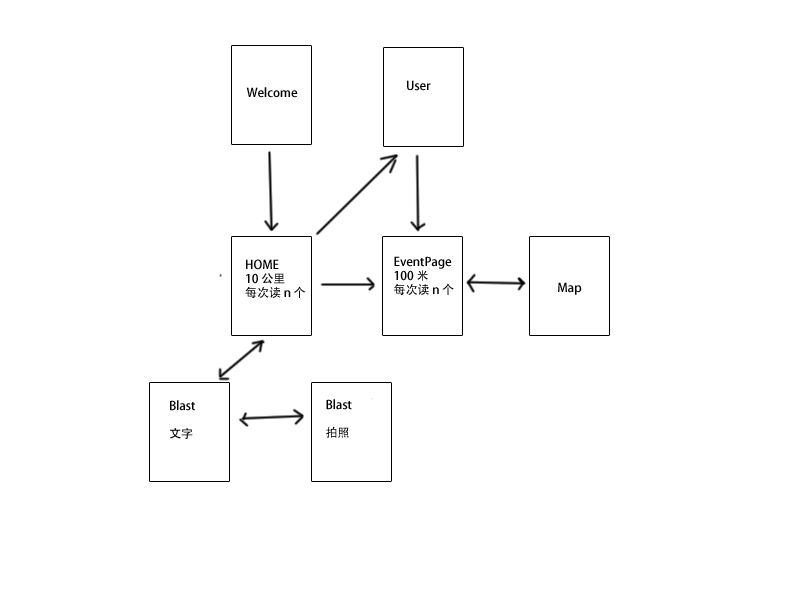

Blast 概述
======

### 特性列表

* 部署到公网
* 传输图片+视频+文字
* 发了以后不能修改
* 一个消息就是一个主题，消息之间有父子关系

### 特性

* Welcom 页
* HOME page 仅仅读取 20 条一次

### Blast的对象

    {
        _id           : "78..90",
        referId       : "3e..ac",         # 引用消息 ID
        referNumber   : 897,              # 有多少消息引用它
        picture       : "79..45", 
        content       : "Hello", 
        createTime    : new Date(),       # Mongo 维护
        lastModifiedm : new Date()        # Mongo 维护
    }
